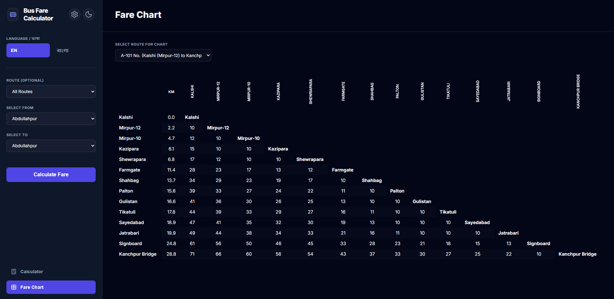

# Dhaka Metro Area Bus Fare List & Calculator

A modern, high-performance web application designed to calculate bus fares for the Dhaka Metropolitan Area based on the official BRTA (Bangladesh Road Transport Authority) fare list.

### [Live Demo](https://imamhossain94.github.io/dhaka-metro-area-bus-fare-list/)



---

## Key Features

*   **Fare Calculator**: Select a route (optional), a starting location, and a destination to instantly see the calculated fare and distance.
*   **Search Without Route**: Simply select "From" and "To" to find all available routes connecting those two locations.
*   **Triangular Fare Chart**: A professional-grade, tree-like triangular table for each route, showing distances and fares between all stops at a glance.
*   **Bilingual Support**: Full support for both **English** and **Bengali (বাংলা)** languages.
*   **Persistent Configuration**: Set your own "Minimum Fare" and "Fare per KM" parameters via a configuration modal. Settings are saved in cookies for future sessions.
*   **Dual Theme Support**: High-contrast Dark and Light modes with persistent user preferences.
*   **Premium UI**: Built with a minimalist aesthetic using **Lucide Icons** and the **Inter** typeface.
*   **Fully Responsive**: Optimized for browsing on desktops, tablets, and mobile devices.

## Data Source & Processing

The data for this application was extracted from the official BRTA fare list:

1.  **Source**: [BRTA Official Fare List](https://brta.gov.bd/pages/static-pages/6922de89933eb65569e1b600)
2.  **Conversion**: PDF files were converted to high-resolution images.
3.  **Extraction**: Data was extracted using OCR and LLM-assisted processing (via chat.qwen.ai) for accurate translation and digitization.
4.  **Structure**: Raw data is stored in `raw_data/` and processed into an optimized JSON format in `web_data/data.json` for fast client-side performance.

## Technology Stack

*   **Frontend**: Vanilla HTML5, CSS3, JavaScript (ES6+)
*   **Icons**: [Lucide Icons](https://lucide.dev/)
*   **Fonts**: [Inter](https://fonts.google.com/specimen/Inter)
*   **Development Utilities**: Node.js scripts for data transformation.

## Local Development

Since the application uses `fetch()` to load JSON data, it must be run through a local server due to browser security (CORS) policies.

1.  **Clone the repository**:
    ```bash
    git clone https://github.com/imamhossain94/dhaka-metro-area-bus-fare-list.git
    cd dhaka-metro-area-bus-fare-list
    ```

2.  **Run a local server**:
    *   Using **Node.js**: `npx serve .`
    *   Using **Python**: `python -m http.server 8000`

---

## Acknowledgments

*   Data provided by **BRTA (Bangladesh Road Transport Authority)**.
*   OCR and extraction assistance by **Qwen**.
*   Icons provided by **Lucide**.

---
Developed by [Imam Hossain](https://github.com/imamhossain94)
